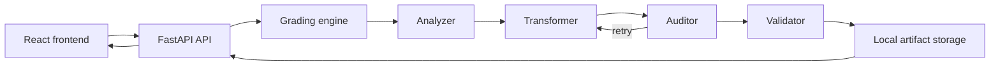

# Axiom Data Infrastructure (ADI)

**A full-stack data-quality and validation application for messy operational data.**

ADI analyzes uploaded CSV or JSON records, repairs what can be fixed safely, quarantines what cannot, and returns an explainable grade so questionable data never silently enters downstream systems.

| | |
|---|---|
| **Live Demo** | [https://adi-frontend.onrender.com](https://adi-frontend.onrender.com) |
| **API Documentation** | [https://axiom-data-infrastructure.onrender.com/docs](https://axiom-data-infrastructure.onrender.com/docs) |
| **Backend API** | [https://axiom-data-infrastructure.onrender.com](https://axiom-data-infrastructure.onrender.com) |
| **Health Check** | [https://axiom-data-infrastructure.onrender.com/health](https://axiom-data-infrastructure.onrender.com/health) |

<!-- Product screenshot can be added here -->

---

## Overview

Operational datasets—ticket logs, material tickets, field exports—often arrive with missing fields, inconsistent dates, invalid quantities, and other defects. Importing that data unchanged creates silent failures later in reporting, ERP, or analytics systems.

ADI addresses that risk with a defensive processing pipeline:

1. Ingest CSV or JSON
2. Detect anomalies against a required AEC ticket schema
3. Apply **safe, deterministic** repairs where rules allow
4. Audit and retry unresolved issues within a bounded loop
5. Quarantine (dead-letter) records that still cannot be made valid
6. Validate the final active set and produce a human-readable quality report

The product prioritizes **data integrity over forcing a green result**. An F grade with quarantined rows is correct behavior when unsafe records remain—not an application crash.

---

## Key Features

- **CSV and JSON ingestion** via REST (`POST /grade/aec`, `POST /grade/aec/upload`) and the React dashboard
- **Anomaly detection** for missing or malformed AEC fields
- **Schema and data validation** with Pydantic models and a deterministic final validation step
- **Safe automated repairs** (for example date normalization and quantity correction) with action metadata
- **Repair confidence and review flags** (`confidence`, `requires_review`) so operators know what needs human attention
- **Audit stage** that inspects cleaned output before acceptance
- **Bounded retry handling** (max 2 retries) for unresolved records
- **Quarantine / dead-lettering** of unrecoverable rows in `failed_records` with original payload and reason
- **Explainable health scoring** with `health_score_explanation`
- **Clean-vs-dirty summary** — data grade, headline, top issues, recommended next steps
- **Run history** (`GET /runs`) and **persisted result artifacts** (`GET /runs/{run_id}/artifact`)
- **React dashboard** — upload/analyze, grade card, repairs, pipeline timeline, unresolved records, raw JSON
- **Backend health monitoring** in the UI via `GET /health`

---

## Processing Pipeline

```text
Analyze → Transform / Repair → Audit → Retry (if needed) → Validate → Complete
```

| Stage | Role |
|-------|------|
| **Analyzer** | Detects field-level anomalies and severity |
| **Transformer** | Applies deterministic repairs and records each change |
| **Auditor** | Checks cleaned output; may request correction while retries remain |
| **Retry** | Bounded retry and repair loop (max 2) before giving up on a row |
| **Validator** | Enforces required AEC fields on the final active set |
| **Complete** | Returns scored results, summary, and processing history |

**Integrity rule:** records that cannot be safely repaired are moved to `failed_records` rather than quietly marked clean. When any failed records remain, `validation_passed` is `false`.

**Processing model:** ADI uses deterministic rule-based processing so repairs, validation decisions, and failure states remain reproducible and explainable.



---

## Example: Messy AEC Sample

Primary demo file: [`samples/aec_messy_sample.csv`](samples/aec_messy_sample.csv)

Verified production behavior (Render frontend + backend):

| Metric | Result |
|--------|--------|
| Records received | 12 |
| Clean | 10 |
| Flagged / quarantined | 2 |
| Validation | Failed |
| Grade / health | F / 0 |

What happened:

- Recoverable issues (for example date formats and repairable quantities) were corrected and recorded in `repairs`
- Two rows could not be made valid and were quarantined
- Validation failed **because** unsafe records remained

This is desirable: ADI repaired what it could and blocked the rest from passing as import-ready data.

Other samples in `samples/`:

| File | Purpose |
|------|---------|
| `aec_clean_sample.csv` | Valid tickets for a passing comparison |
| `aec_messy_sample.json` | JSON batch for `POST /grade/aec` |
| `unrecoverable_aec_ticket.csv` | Batch where unresolved rows are expected |

AEC schema fields: `ticket_id`, `date`, `customer`, `material`, `quantity`, `unit`, `job_site`.

---

## Technology Stack

| Layer | Technologies |
|-------|----------------|
| Backend | Python, FastAPI, Pydantic, Uvicorn |
| Frontend | React, TypeScript, Vite |
| API | REST (JSON + multipart CSV upload) |
| CI | GitHub Actions |
| Hosting | Render (frontend and backend as separate services) |
| Testing | pytest, Vitest, React Testing Library |

---

## Architecture

| Component | Location | Purpose |
|-----------|----------|---------|
| React demo UI | `frontend/` | Upload, grade visualization, run history, artifact preview |
| FastAPI service | `backend/api/` | HTTP routes, CORS, health |
| Schemas & config | `backend/core/` | Pydantic contracts, CORS origins, logging |
| Engine | `backend/engine/` | Orchestration, scoring, final validation |
| Agents | `backend/agents/` | Analyzer, Transformer, Auditor |
| Storage | `backend/storage/` | Local artifact + run index persistence (`StorageBackend`) |
| Samples | `samples/` | Repeatable demo inputs |

**MVP storage caveat:** run artifacts live on the local filesystem (`local_artifacts/`). On Render, history may reset after redeploy or restart. Interfaces are structured so artifacts could later map to object storage and metadata to a database without changing the grading workflow.

---

## Testing and CI

On push and pull request to `main`, GitHub Actions runs:

- Backend: `pytest backend/tests`
- Frontend: `npm test` and `npm run typecheck` (in `frontend/`)

```bash
pytest backend/tests
cd frontend && npm test && npm run typecheck && npm run build
python scripts/smoke_backend.py --base-url https://axiom-data-infrastructure.onrender.com
```

Deployed smoke checklist: [docs/deployment_smoke_test.md](docs/deployment_smoke_test.md).

---

## Running Locally

### Backend

```bash
python3 -m venv .venv
source .venv/bin/activate
pip install -r backend/requirements.txt

# Optional: copy root .env.example → .env for APP_ENV / LOG_LEVEL / ADI_ENGINE_VERSION
uvicorn backend.api.app:app --reload --port 8000
```

### Frontend

```bash
cd frontend
npm install
cp .env.example .env
npm run dev
```

Open [http://127.0.0.1:5173](http://127.0.0.1:5173).

### Environment configuration

| Variable | Where | Purpose |
|----------|-------|---------|
| `VITE_API_BASE_URL` | `frontend/.env` (build/dev time) | Backend base URL. Default: `http://127.0.0.1:8000` |
| `ADI_CORS_ORIGINS` | Backend env / Render | Comma-separated extra browser origins (production frontend) |
| `APP_ENV` | Backend | Environment label (default `development`) |
| `LOG_LEVEL` | Backend | Log verbosity (default `INFO`) |
| `ADI_ENGINE_VERSION` | Backend | Reported by `GET /health` (default `0.1.0`) |

Local frontend against deployed API:

```bash
# frontend/.env
VITE_API_BASE_URL=https://axiom-data-infrastructure.onrender.com
```

Restart Vite after changing `.env`. Do not commit `.env` files.

### Quick API checks

```bash
curl http://127.0.0.1:8000/health

curl -X POST "http://127.0.0.1:8000/grade/aec/upload" \
  -F "file=@samples/aec_messy_sample.csv"
```

Main endpoints: `GET /`, `GET /health`, `POST /grade/aec`, `POST /grade/aec/upload`, `GET /runs`, `GET /runs/{run_id}`, `GET /runs/{run_id}/artifact`. Interactive docs: `/docs`.

---

## Deployment

| Service | URL | Notes |
|---------|-----|-------|
| Frontend | [adi-frontend.onrender.com](https://adi-frontend.onrender.com) | Vite build; `VITE_API_BASE_URL` set at build time |
| Backend | [axiom-data-infrastructure.onrender.com](https://axiom-data-infrastructure.onrender.com) | `render.yaml` blueprint; health check `/health` |

Production CORS for the live frontend:

```text
ADI_CORS_ORIGINS=https://adi-frontend.onrender.com
```

After deploy, confirm backend `/health` and that the frontend **Backend Status** shows connected. Full steps: [docs/deployment_smoke_test.md](docs/deployment_smoke_test.md).

---

## Repository Structure

```text
axiom-data-infrastructure/
├── backend/           # FastAPI API, agents, engine, storage, tests
├── frontend/          # React + TypeScript + Vite demo UI
├── samples/           # Demo CSV/JSON inputs
├── docs/              # Deployment smoke checklist
├── scripts/           # Backend smoke helper
├── src/               # Optional TypeScript operator CLI
├── .github/workflows/ # CI
└── render.yaml        # Backend Render blueprint
```

Generated artifacts under `output/` and `local_artifacts/` are gitignored.

---

## Design Philosophy

> **Repair what can be repaired safely. Quarantine what cannot. Never silently pass questionable data downstream.**

ADI treats a failed validation with quarantined rows as a successful *integrity* outcome: recoverable data is improved, and unresolved records are made explicit for operator review.

---

## Portfolio / Engineering Highlights

- Full-stack FastAPI + React/TypeScript application with REST ingestion for CSV and JSON
- Deterministic validate / repair / audit / quarantine pipeline with explainable scoring
- Automated pytest and Vitest coverage, GitHub Actions CI, and Render deployment

---

## Optional: TypeScript Operator CLI

Separate from the hosted Live Demo: a local TypeScript operator workflow (`src/`, root `npm run dev`) for CSV batch grading and reports under `output/runs/`. See root `package.json` scripts (`dev`, `runs`, `test`, `typecheck`).
